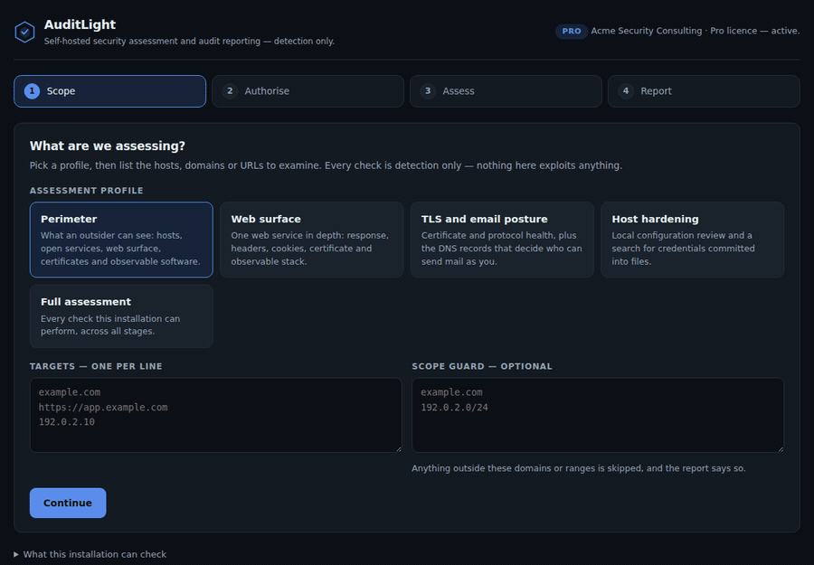
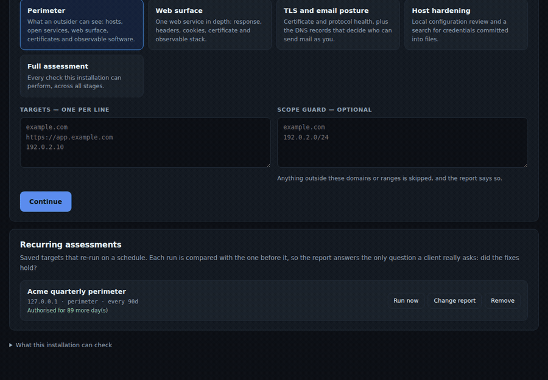
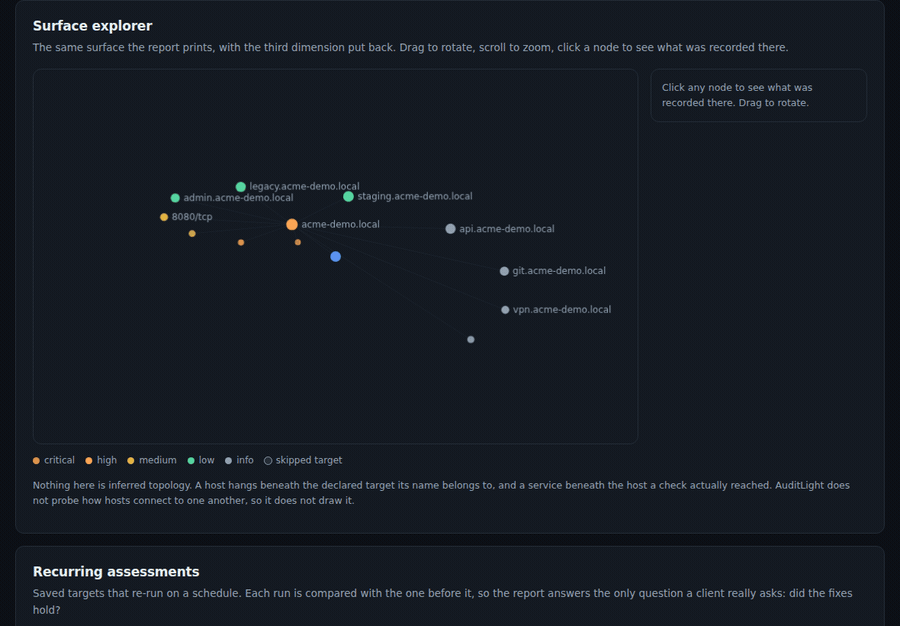

# AuditLight

**Self-hosted security assessment and audit reporting — detection only.**

AuditLight runs a set of non-exploit security checks against assets you are authorised to
test, normalises every result into one finding model, and produces audit reports: what
actually ran, what was found, **what changed since last time**, and **what your surface
actually looks like**.

One static binary. No cloud, no database server, no container runtime, no agent, no
telemetry, and no special Linux distribution.



---

## Why it exists

Running an assessment is not the hard part. Anyone can run six CLI tools. The hard part is
turning six different output formats into a document a client or an auditor will accept,
and doing it without accidentally taking production down.

Then, three months later, comes the harder part: proving the fixes held.

AuditLight does all of it. It runs the checks, writes the report, and tracks the assessment
over time.

## Three promises

**1. It never exploits.** AuditLight detects and audits. It does not attempt exploitation,
brute force, denial of service, or offensive fuzzing. This is a permanent product boundary,
not a default setting you can switch off — the orchestrator refuses intrusive arguments even
when passing them to an external tool.

**2. It works offline.** Every built-in check is implemented on the Go standard library.
The binary links no third-party module, so it runs on an air-gapped host, and the reports it
writes are self-contained HTML that open with no network access.

**3. Authorisation is enforced, not assumed.** No job starts without a recorded authorisation
statement, and that statement is printed in the report as evidence of due diligence. For
recurring assessments it also **expires**, so permission is something you renew rather than
something you clicked once.

---

## Install

```sh
tar xzf auditlight-free-0.3.0-linux-amd64.tar.gz
sha256sum -c SHA256SUMS
./auditlight
```

Then open <http://127.0.0.1:8431>.

Tested on Ubuntu 24.04 / 22.04 LTS and Debian 12 (amd64). The RHEL family and Alpine are
best-effort. Linux only.

Build from source instead, if you prefer — there is nothing to fetch:

```sh
go build ./cmd/auditlight
```

## Use

1. **Scope** — pick a profile and list the hosts, domains or URLs to assess. An optional
   scope guard skips anything outside the domains or CIDRs you declare, and records why.
2. **Authorise** — give an operator name, accept the authorisation statement, and re-enter
   the target list. Typing them a second time is what turns a reflex click into a
   deliberate act.
3. **Assess** — checks run in stages: discovery, then the network, then each service, then
   the conclusions drawn from them.
4. **Report** — open the Assessment Report and the Process Report. Both print cleanly to PDF.

### Assessment profiles

| Profile | What it covers |
|---|---|
| `perimeter` | What an outsider sees: subdomains, open services, banners, web surface, certificates, observable software |
| `web` | One web service in depth: response, headers, cookies, certificate, stack |
| `tls-email` | Certificate and protocol health, plus SPF, DKIM, DMARC and MTA-STS |
| `hardening` | Local configuration review and a search for credentials committed into files |
| `full` | Everything this installation can run |

---

## Tracking change over time

Save an assessment, run it again later, and AuditLight tells you exactly what moved.



Every finding from both runs is placed in exactly one class:

| Class | Meaning |
|---|---|
| **new** | Present now, absent from the previous run |
| **regressed** | Present in both, more severe now |
| **persisting** | Present in both, unchanged |
| **improved** | Present in both, less severe now |
| **resolved** | Present before, absent now |

Matching is by finding identity — derived from target, port, category and the specific
condition — never by text. A finding that moves to a different host is correctly treated as
a different finding.

**Authorisation expires.** A saved assessment carries the authorisation you gave it for a
fixed window, 90 days by default. When it lapses, scheduled runs stop and say so, and a
human has to re-affirm before they resume. This is deliberate: a permission that never
expires is not a permission.

**"No longer detected" is not "fixed."** A finding also leaves the results when the check
that produced it could not run, or a target was skipped. The Change Report says so, and the
Process Report tells you which it was. Read them together before telling a client something
was remediated.

**Notifications** go out per assessment, not per finding, over a webhook or plain SMTP.
Rules are `change`, `worse` (new or regressed only), or `never`. A notification that fails
is recorded rather than swallowed.

This is change tracking, not monitoring. Nothing is watched between runs; a problem that
appears and disappears in the gap is never seen. For continuous checks see the rest of the
[Hexward line](https://whop.com/nizar-tuanku/hexward-suite?utm_source=github).

---

## Seeing the surface

Every assessment produces a map of what was found where: each declared target, each host
observed beneath it, each service a check actually reached, and the findings recorded
against each.



It is drawn twice, in two different shapes, because the two places it appears have
different jobs.

**In the report — a printed tree.** The Assessment Report carries the map as inline SVG:
one row per node, ordered worst-first, no overlap, no interaction required. It prints to
PDF with everything else and it reads the same in black and white.

**In the dashboard — the Surface Explorer.** On screen the map is a graph you can rotate,
zoom and click. Rotation is the point: a surface with a few dozen services is a hairball
in two dimensions, and parallax separates it in a way no static layout can. Click any node
to see what was recorded there.

The explorer is drawn with a hand-written perspective projection on a plain 2D canvas —
no WebGL, no 3D library, no third-party code of any kind. It is part of the free edition.

**What the picture does not claim.** AuditLight performs no traceroute and no adjacency
probing, so it does not know how your hosts reach one another, and it does not draw it. A
host appears under a target because its name is that target or a DNS-suffix of it. A
service appears under a host because a check observed that port. Nothing in either picture
is inferred network topology — a diagram gets believed faster than a sentence, so this one
only draws what was seen.

Saved assessments get a third picture: an **assessment timeline** in the Change Report, a
host × run grid showing how each host moved across every run. Cells for "assessed and
nothing found" and "not assessed" are deliberately different colours *and* different
shapes, because those two states look alike in a naive heatmap and mean opposite things.

---

## What it checks

All of these are built in. None of them requires anything else installed.

| Check | What it does |
|---|---|
| `subdomain` | Resolves an embedded list of common subdomain names, with wildcard detection |
| `portscan` | TCP connect scan across a curated port set |
| `banner` | Reads service banners with a hard read limit |
| `httpprobe` | HTTP status, title, headers, server software, technology fingerprint |
| `headers` | Security headers and cookie flags |
| `tlsaudit` | Protocol versions, cipher strength, certificate validity, chain, key size |
| `dnsemail` | SPF, DKIM, DMARC, MTA-STS, MX, NS |
| `secrets` | Credentials and private keys in a nominated filesystem path |
| `vulnsig` | Version-based matching against an embedded signature set |

### Optional external tools

If these are on `PATH`, matching adapters use them and the extra coverage is credited in the
report. If they are absent, the assessment still completes, and the report says which
capabilities were missing — a check that never ran must not read as a check that passed.

| Tool | Adds | Enforced safe mode |
|---|---|---|
| `nuclei` | Template-based detection | `-etags intrusive,dos,fuzz`, no out-of-band callbacks |
| `testssl.sh` | Deep TLS analysis | JSON output only |
| `lynis` | Host hardening audit | `audit system --quick`, read-only |
| `nmap` | Extended service detection | `-sV -sT --script safe`; exploit, intrusive and DoS scripts excluded |

```sh
# Debian / Ubuntu
sudo apt install -y testssl.sh lynis
# nmap is NOT distributed with AuditLight — install it yourself if you want it
sudo apt install -y nmap
```

**nmap is never bundled.** Its licence forbids redistribution inside a commercial product,
so AuditLight uses its own connect scan by default and treats nmap as strictly
bring-your-own.

---

## Honest limits

Read these before you rely on a report.

- **Non-exploit means exploitability is not proven.** A finding marked *confirmed* was
  observed directly. One marked *likely* rests on inference, most often a version string —
  and distributions routinely back-port fixes without changing it. One marked *potential* is
  a signal worth checking, not a conclusion.
- **This is not a penetration test.** No business-logic testing, no chaining of weaknesses,
  no human creativity. It finds the recurring, mechanical problems well; it does not replace
  a tester who thinks about your application.
- **False positives happen**, especially with version-based detection. Every finding carries
  its evidence so you can check rather than trust.
- **Coverage is the visible surface.** Anything behind authentication is out of scope.
- **The embedded signature set is small and conservative.** It is not a vulnerability feed.
  Absence of a match is not evidence that a version is unaffected — that is what the optional
  nuclei adapter is for.
- **Change tracking compares snapshots, it does not monitor.** Nothing is watched between
  runs.
- **The surface map is a map of what was observed, not of your network.** No routes, no
  trust relationships, no adjacency — those were never measured, so they are never drawn.
- **Offline means you own freshness.** Nothing updates itself.
- **Control mapping supports an audit; it does not certify one.** It is not a legal opinion.
- **Linux only.**

## Free and paid editions

This repository is the free edition and is fully functional: the built-in checks, the
`perimeter` and `web` profiles, the authorisation gate, the Process Report, and a
watermarked preview of the Assessment Report.

The Surface Explorer and the attack surface map are in the free edition too. The paid
editions add every profile, the external tool adapters, the full Assessment Report with
evidence and remediation, saved and scheduled assessments with the Change Report and the
assessment timeline, notifications, machine-readable export, multi-tool correlation, report
branding, and control mapping to ISO 27001:2022, CIS v8, NIST CSF 2.0 and UU PDP.

| | Free | Pro | Team |
|---|---|---|---|
| Profiles | `perimeter`, `web` | all | all |
| Targets per job | 3 | unlimited | unlimited |
| Findings shown | 50 (overflow counted, never silent) | unlimited | unlimited |
| Assessment Report | preview | full | full |
| Saved assessments | — | 10 | unlimited |
| Scheduling + Change Report | — | yes | yes |
| Notifications | — | yes | yes |
| External tools | — | yes | yes |
| Export (JSON) | — | yes | yes |
| Control mapping | — | ISO 27001, CIS v8 | + NIST CSF 2.0, UU PDP |
| Attack surface map + explorer | yes | yes | yes |
| Assessment timeline | — | yes | yes |
| Report branding | — | logo and name | full white-label |

→ **[Get AuditLight Pro or Team on Whop](https://whop.com/nizar-tuanku/auditlight?utm_source=github)**

## Configuration

```
  -listen string        address to listen on (default "127.0.0.1:8431")
  -data string          directory for job data (default "$HOME/.auditlight")
  -memory               keep jobs in memory only; nothing is written to disk
  -license string       licence key (or set AUDITLIGHT_LICENSE)
  -firm string          firm name shown on reports (paid tiers)
  -contact string       contact line in the report footer (paid tiers)
  -white-label          replace the AuditLight name on reports (Team tier)
  -console-url string   base URL used in notification links
  -no-schedule          do not run scheduled re-assessments
  -smtp-host string     SMTP host for e-mail notifications
  -smtp-port int        SMTP port (default 587)
  -smtp-user string     SMTP username
  -smtp-pass string     SMTP password (or set AUDITLIGHT_SMTP_PASS)
  -smtp-from string     From address for notifications
  -smtp-starttls        upgrade the SMTP connection with STARTTLS (default true)
  -version              print version and exit
```

## HTTP API

| Method | Path | Purpose |
|---|---|---|
| `GET` | `/api/status` | Version, licence, capability matrix |
| `GET` | `/api/profiles` | Profiles and whether the licence allows them |
| `POST` | `/api/jobs` | Create a job (requires the authorisation payload) |
| `GET` | `/api/jobs/{id}` | Job detail with live progress |
| `GET` | `/api/jobs/{id}/findings` | Ranked findings |
| `GET` | `/api/jobs/{id}/surface.json` | Attack-surface graph the explorer draws |
| `GET` | `/api/jobs/{id}/report/process` | Process Report (HTML) |
| `GET` | `/api/jobs/{id}/report/assessment` | Assessment Report (HTML) |
| `GET` | `/api/jobs/{id}/report/delta` | Change Report (HTML, paid) |
| `GET` | `/api/jobs/{id}/delta` | Comparison as JSON (paid) |
| `GET` | `/api/jobs/{id}/export.json` | Machine-readable export (paid) |
| `POST` | `/api/definitions` | Save an assessment (paid) |
| `GET` | `/api/definitions` | List saved assessments |
| `POST` | `/api/definitions/{id}/run` | Run one now |
| `POST` | `/api/definitions/{id}/reauthorise` | Restart the authorisation clock |
| `DELETE` | `/api/definitions/{id}` | Remove a saved assessment |

Tier limits answer `402`. Authorisation failures answer `403`. Both carry a readable message.

## Responsible use

Assess only what you own or have written permission to assess. AuditLight records your
authorisation statement in a hash-chained log and prints it in the report, which protects
you — but the responsibility for having that authorisation is yours.

## Credits

AuditLight is built on the Go standard library alone. The optional adapters orchestrate
[nuclei](https://github.com/projectdiscovery/nuclei),
[testssl.sh](https://github.com/drwetter/testssl.sh),
[Lynis](https://github.com/CISOfy/lynis) and [nmap](https://nmap.org), each under its own
licence and each invoked as a separate process. Thanks to their maintainers.

## Licence

Apache License 2.0 — see [LICENSE](LICENSE).

---

Part of the **Hexward** line of self-hosted security tools ·
[Whop](https://whop.com/nizar-tuanku/hexward-suite?utm_source=github) ·
[Instagram](https://instagram.com/nizartuanku) ·
[YouTube](https://youtube.com/@nizartuanku) ·
[TikTok](https://tiktok.com/@nizartuanku)
